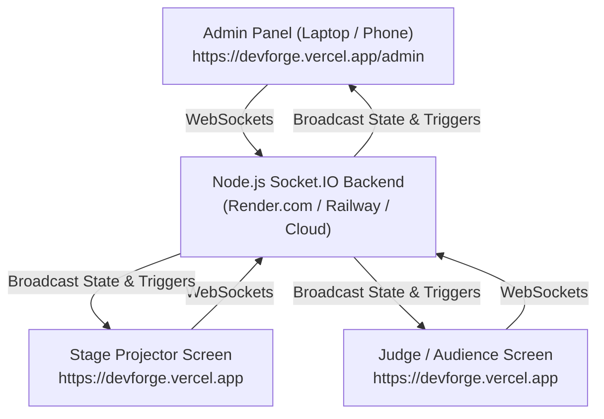

# DevForge Real-Time Backend Deployment & Setup Guide

This guide explains how to deploy the Node.js backend server so that the Admin Panel and Stage Screens communicate in real-time across different computers, screens, projectors, and mobile devices over the internet.

---

## Architecture Overview



Whenever the admin clicks **Start**, **Pause**, **Reset**, **Adjust Time**, or triggers **Kollywood Popups** (Kaapi Break, Briyani Time, etc.) or **Announcements**, the backend instantly broadcasts the action to every connected screen worldwide within ~50ms.

---

## ⚡ Option 1: Deploy to Render.com (Recommended & Free)

Render provides free Node.js hosting with persistent WebSockets support.

### Step 1: Push Changes to GitHub
Commit and push your updated project to your GitHub repository:
```bash
git add .
git commit -m "Add real-time Node.js Socket.IO backend and sync service"
git push
```

### Step 2: Create a Free Web Service on Render
1. Go to [Render.com](https://render.com) and sign in (using GitHub).
2. Click **New +** -> **Web Service**.
3. Select your `devforge_countdown` GitHub repository.
4. Fill in the settings:
   - **Name**: `devforge-countdown-backend` (or any name you like)
   - **Region**: Closest to your event location (e.g., Singapore or Frankfurt)
   - **Root Directory**: `server`
   - **Runtime**: `Node`
   - **Build Command**: `npm install`
   - **Start Command**: `node server.js`
   - **Instance Type**: `Free`
5. Click **Deploy Web Service**.
6. Once deployed, Render will provide you with a public URL, for example:
   `https://devforge-countdown-backend.onrender.com`

---

## ⚡ Option 2: Deploy to Railway.app

1. Go to [Railway.app](https://railway.app) and sign in.
2. Click **New Project** -> **Deploy from GitHub repo**.
3. In settings, set **Root Directory** to `/server`.
4. Click **Deploy**. Railway will generate a public domain URL.

---

## 🔗 How to Connect Your Vercel Frontend to the Backend

You have **two easy ways** to connect:

### Method A: Live in the Admin Panel (Zero Redeploy Needed! 🚀)
1. Open your Vercel URL: `https://your-devforge.vercel.app/admin`.
2. Notice the top-right status pill: click **"Local Mode (Connect Backend)"**.
3. In the modal, paste your deployed backend URL:
   `https://devforge-countdown-backend.onrender.com`
4. Click **Save & Connect**.
5. The pill will immediately turn **🟢 Live Sync: X screens online**!
*(This is saved in your browser so you never have to re-enter it).*

### Method B: Vercel Environment Variable (Permanent for All Users)
1. Open your [Vercel Dashboard](https://vercel.com).
2. Go to your project -> **Settings** -> **Environment Variables**.
3. Add a new variable:
   - **Key**: `VITE_BACKEND_URL`
   - **Value**: `https://devforge-countdown-backend.onrender.com`
4. Go to **Deployments** and click **Redeploy** on your latest deployment.
5. Now every visitor on any device automatically connects to the real-time server by default!

---

## 💻 Local Testing (Running on the Same WiFi / Computer)

1. Start the backend:
   ```bash
   npm run server
   ```
   *(Runs on http://localhost:3001)*

2. Start the Vite dev server:
   ```bash
   npm run dev
   ```

3. Open `http://localhost:5173/admin` in one browser tab, and `http://localhost:5173/` in another tab (or on your phone connected to the same WiFi using your machine's local IP, e.g. `http://192.168.1.X:5173`).
4. Any button clicked in Admin will instantly reflect on the stage screen!
